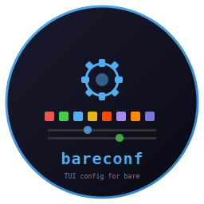

# bareconf - TUI Config for bare



     

TUI configuration tool for the [bare](https://github.com/isene/bare) shell, built on [crust](https://github.com/isene/crust). Provides a visual interface for all bare settings.

<br clear="left"/>

## Features

- 256-color palette picker for all 16 color slots
- Live prompt preview showing changes in real time
- 6 built-in themes (default, solarized, dracula, gruvbox, nord, monokai)
- Browse and manage nicks, gnicks, abbreviations, and bookmarks
- Reads and writes `~/.barerc` directly

## Controls

| Key | Action |
|-----|--------|
| TAB | Cycle between panels |
| Arrows | Navigate within panel |
| Enter | Apply selection |
| s | Save configuration |
| q | Quit |

## Build

```bash
cargo build --release
```

## Part of the Fe2O3 Rust Terminal Suite

| Tool | Clones | Type |
|------|--------|------|
| [bare](https://github.com/isene/bare) / [rush](https://github.com/isene/rush) | [rsh](https://github.com/isene/rsh) | Shell |
| **[bareconf](https://github.com/isene/bareconf)** | | **Shell config TUI** |
| [crust](https://github.com/isene/crust) | [rcurses](https://github.com/isene/rcurses) | TUI library |
| [glow](https://github.com/isene/glow) | [termpix](https://github.com/isene/termpix) | Image display |
| [plot](https://github.com/isene/plot) | [termchart](https://github.com/isene/termchart) | Charts |
| [pointer](https://github.com/isene/pointer) | [RTFM](https://github.com/isene/RTFM) | File manager |

## License

[Unlicense](https://unlicense.org/) - public domain.

## Credits

Created by Geir Isene (https://isene.org) with extensive pair-programming with Claude Code.
